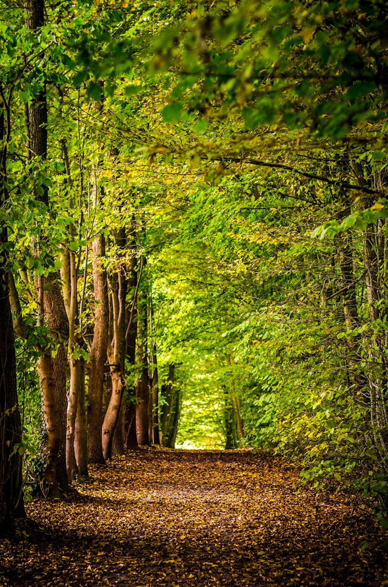
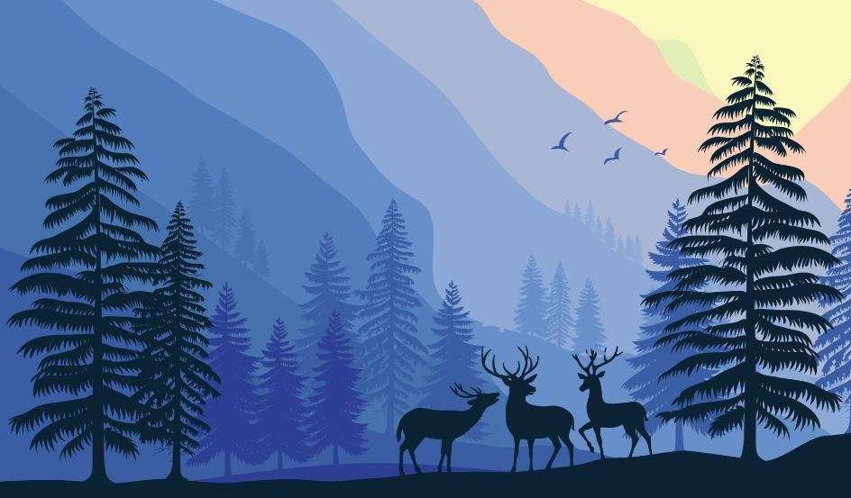

# Types of Images

## What is a photo?

A **photo** is an image captured with a camera, showing exactly what something or someone looks like in real life. It's a reflection of the real world, capturing things like light, shadows, colors, and details, just as they appear at the moment the picture was taken.

<figure><figcaption>
Photo from unsplash.com (<a href="https://unsplash.com/@david_bxl">David Bruyndonckx</a>)
</figcaption></figure>

## What is an illustration?

An **illustration**, on the other hand, is a drawing or painting created by an artist. It doesn’t have to show exactly what something looks like in real life—it can be more creative or stylized. Artists can use their imagination to exaggerate features, add colors, or even change the way things look entirely.

So, while a photo captures reality, an illustration allows more artistic freedom to show things in a unique or creative way!

<figure><figcaption>
Illustration from vecteezy.com (<a href="https://www.vecteezy.com/members/krustovin">krustovin</a>)
</figcaption></figure>

\
